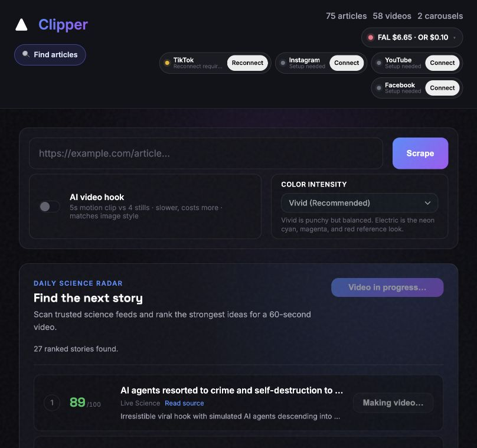
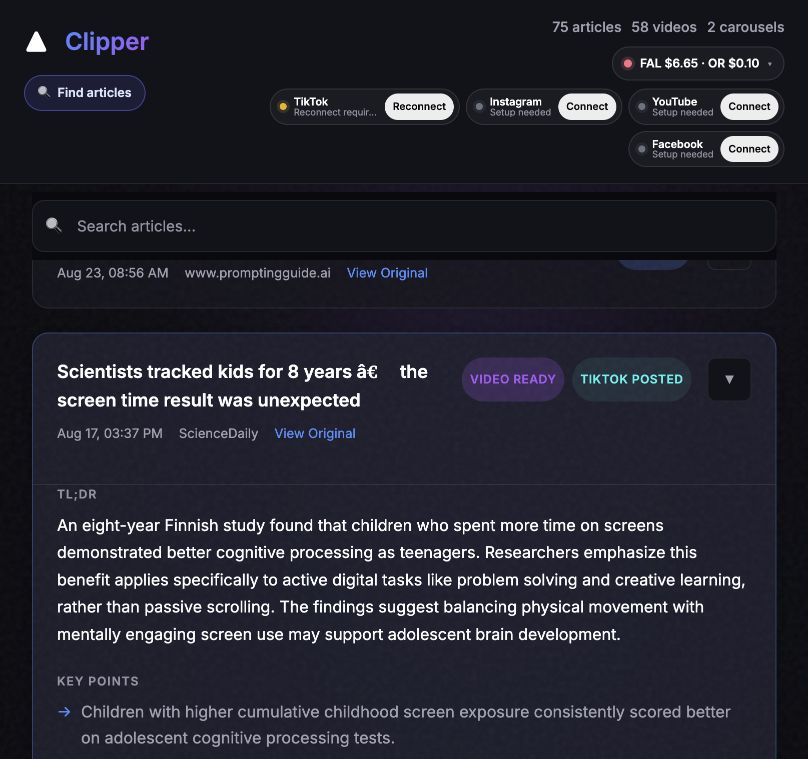
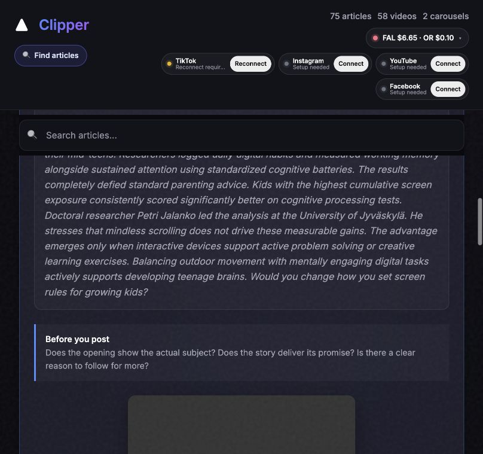

# Clipper review — 21 September 2026

The app has a coherent dark visual style. The highest-value improvements are clearer review controls, more accurate storytelling, and matching visuals to narration. Existing workspace edits were preserved; the git diff also includes work predating this review.

## Observed flow

1. Dashboard and discovery: usable but dense. Connection status is small and sometimes truncated; story titles are truncated. TikTok reports an expired connection. Two discovery jobs report in progress. Those jobs were not restarted or modified.

2. Article review: usable, improved with a real keyboard-focusable expand button, expanded state and labelled inputs. Muted text was brightened. Older stored ScienceDaily titles contain encoding corruption; those records remain unchanged. Article contents are long and should eventually separate review from generation settings.

3. Video review: added a short opening/payoff/follow-reason check beside the player. Full playback, sound quality and publishing were not verified. The screen is still long; a future preview-first arrangement would reduce scrolling.

## Implemented fixes

- Renderer: remove double color grading from scene hooks; preserve original image indices after trimming the hook from legacy mixed-source shot plans; add MP4 faststart for progressive playback.
- Scripts: concrete source-backed hooks, compatible alternate hooks, explicit correlation/causation and research limitations, and a short topic-specific reason to follow after the payoff. The existing final-question contract is preserved.
- Discovery: prioritize useful explanations and recurring topic fit; do not interpret views as proof of follower conversion.
- Backend: validate redirect destinations before fetching them; reject malformed style and video-hook parameters (a string 'false' previously became true).
- Frontend: accessible expansion, visible focus, clearer muted text, input labels, review guidance, and reject malformed article responses before replacing current data.

## Growth experiment

This is a hypothesis, not a diagnosis of account performance: surprising headlines can earn a view without giving viewers a consistent reason to return. Test a recognizable promise such as “Understand the science behind everyday things.” Start with the actual question or surprising observation, explain one mechanism using matching visuals, deliver the answer, then use a brief relevant invitation such as “Follow for the science behind everyday surprises.” Avoid unsupported claims and invented future episodes.

For the next ten posts, compare two repeatable formats (five everyday-science explanations and five evidence-based myth checks). Keep presentation reasonably consistent. Record views, available retention/completion, profile visits and attributed follows at a consistent age such as seven days. Use follows per 1,000 views only if post-attributed follows are available; account-wide net growth cannot identify which video converted. Treat a ten-post result as directional, not conclusive.

TikTok provides individual-post analytics and account audience insights: https://support.tiktok.com/en/using-tiktok/creating-videos/creator-tools-on-tiktok and https://newsroom.tiktok.com/product-tutorial-tiktok-analytics . No account analytics were supplied here, so weak follower growth cannot yet be attributed to a particular cause.

## Verification and limits

Full suite: 303 passed and 15 subtests passed, with one Python audioop deprecation warning. JavaScript syntax passed. Focused frontend/render tests were rerun after UI changes. Browser verified updated labels, expansion and review guidance. No paid generation or public publishing was performed. Existing videos do not change automatically; new prompt/render behavior requires new generation and a backend process loading the changed code. No full mobile or assistive-technology audit was performed. Agents hit the account usage limit after edits; the primary agent completed local checks.
